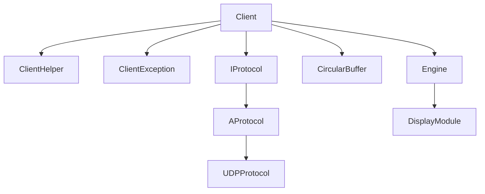

# Architecture

```mermaid

flowchart TD

Client --> ClientHelper

Client --> ClientException

Client --> IProtocol --> AProtocol --> UDPProtocol

Client --> CircularBuffer

Client --> Engine --> DisplayModule

```
