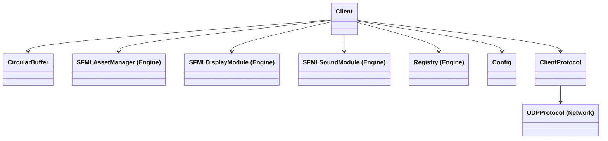

# Architecture

This document represents the architecture of the Client part of the r-type.

```mermaid
classDiagram

Client --> CircularBuffer

class SFMLAssetManager["SFMLAssetManager (Engine)"]
Client --> SFMLAssetManager
class SFMLDisplayModule["SFMLDisplayModule (Engine)"]
Client --> SFMLDisplayModule
class SFMLSoundModule["SFMLSoundModule (Engine)"]
Client --> SFMLSoundModule
class Registry["Registry (Engine)"]
Client --> Registry

Client --> Config
Client --> ClientProtocol

class UDPProtocol["UDPProtocol (Network)"]
ClientProtocol --> UDPProtocol
```
