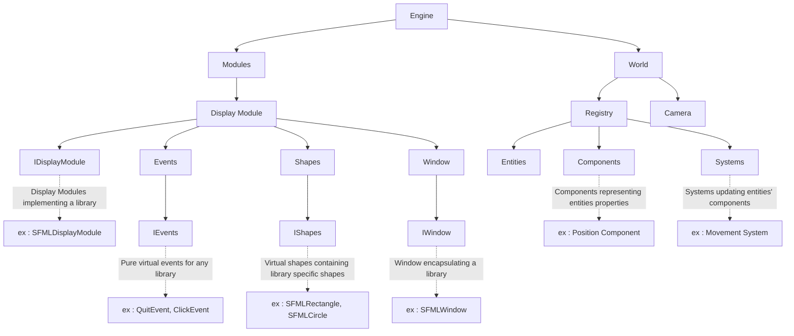

```mermaid
flowchart TD

Eng[Engine]

Eng --> Mod
Eng --> Wr

Mod[Modules] --> DMod

DMod[Display Module] --> +DMod
+DMod[IDisplayModule] -. Display Modules implementing a library .-> -DMod
-DMod[ex : SFMLDisplayModule]

Evt[Events]
Sh[Shapes]
Win[Window]

DMod --> Evt --> +Evt
DMod --> Sh --> +Sh
DMod --> Win --> +Win

+Evt[IEvents] -. Pure virtual events for any library .-> -Evt
-Evt[ex : QuitEvent, ClickEvent]

+Sh[IShapes] -. Virtual shapes containing library specific shapes .-> -Sh
-Sh[ex : SFMLRectangle, SFMLCircle]

+Win[IWindow] -. Window encapsulating a library .-> -Win
-Win[ex : SFMLWindow]

Ecs[Registry]
Ent[Entities]
Comp[Components] -. Components representing entities properties .-> -Comp
Sys[Systems] -. Systems updating entities' components .-> -Sys

-Comp[ex : Position Component]

-Sys[ex : Movement System]

Ecs --> Ent
Ecs --> Comp
Ecs --> Sys

Cam[Camera]

Wr[World]

Wr --> Ecs
Wr --> Cam
```