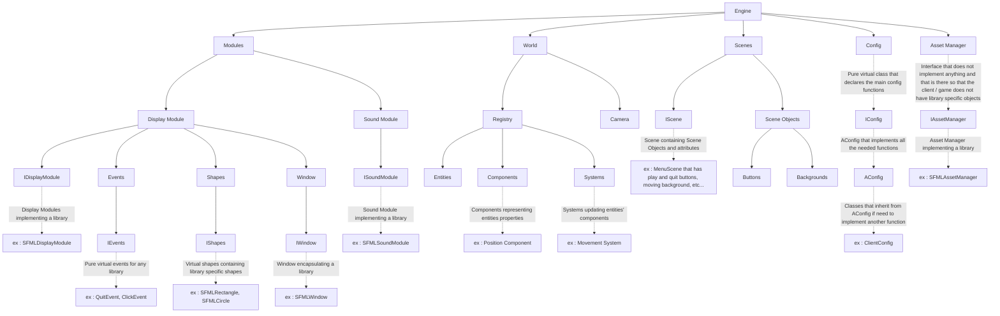

```mermaid
flowchart TD

Eng[Engine]

Eng --> Mod
Eng --> Wr
Eng --> Sc
Eng --> Cf
Eng --> AM

Mod[Modules] --> DMod
Mod --> SMod

DMod[Display Module] --> +DMod
+DMod[IDisplayModule] -. Display Modules implementing a library .-> -DMod
-DMod[ex : SFMLDisplayModule]

SMod[Sound Module] --> +SMod
+SMod[ISoundModule] -. Sound Module implementing a library .-> -SMod
-SMod[ex : SFMLSoundModule]

Evt[Events]
Sh[Shapes]
Win[Window]

DMod --> Evt --> +Evt
DMod --> Sh --> +Sh
DMod --> Win --> +Win

+Evt[IEvents] -. Pure virtual events for any library .-> -Evt
-Evt[ex : QuitEvent, ClickEvent]

+Sh[IShapes] -. Virtual shapes containing library specific shapes .-> -Sh
-Sh[ex : SFMLRectangle, SFMLCircle]

+Win[IWindow] -. Window encapsulating a library .-> -Win
-Win[ex : SFMLWindow]

Ecs[Registry]
Ent[Entities]
Comp[Components] -. Components representing entities properties .-> -Comp
Sys[Systems] -. Systems updating entities' components .-> -Sys

-Comp[ex : Position Component]

-Sys[ex : Movement System]

Ecs --> Ent
Ecs --> Comp
Ecs --> Sys

Cam[Camera]

Wr[World]

Wr --> Ecs
Wr --> Cam

Sc[Scenes] --> +Sc
+Sc[IScene] -. Scene containing Scene Objects and attributes .-> -Sc
-Sc[ex : MenuScene that has play and quit buttons, moving background, etc...]

Sc --> ScObj
ScObj --> Btns
ScObj --> Bckg

ScObj[Scene Objects]
Btns[Buttons]
Bckg[Backgrounds]

Cf[Config] -. Pure virtual class that declares the main config functions .-> ++Cf
++Cf[IConfig] -. AConfig that implements all the needed functions .-> +Cf
+Cf[AConfig] -. Classes that inherit from AConfig if need to implement another function .-> -Cf
-Cf[ex : ClientConfig]

AM[Asset Manager] -. Interface that does not implement anything and that is there so that the client / game does not have library specific objects .-> +AM
+AM[IAssetManager] -. Asset Manager implementing a library .-> -AM
-AM[ex : SFMLAssetManager]
```