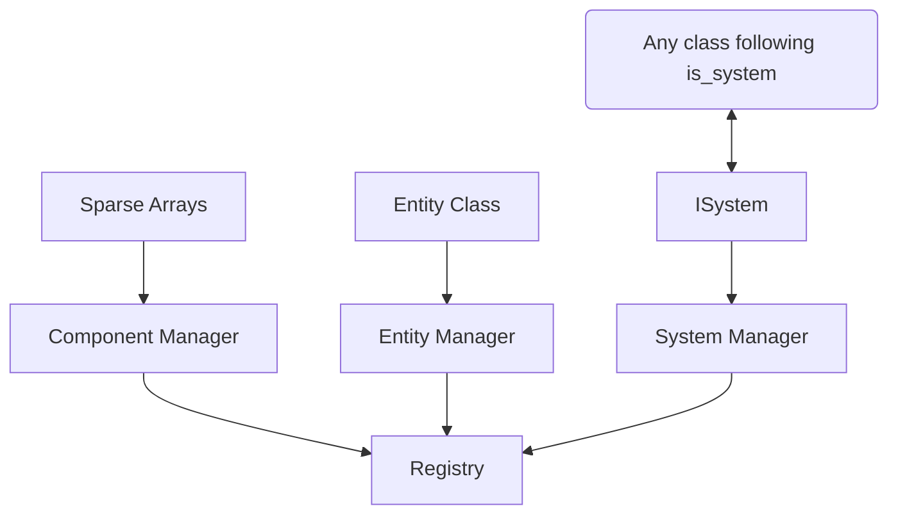

# R-Type ECS

This is the documentation explaining how the ECS of our game engine works.

## Sparse Arrays

Sparse Arrays are what hold the components of this ECS. It is a template class, holding :
```cpp
std::vector<std::optional<Component>>
// Component here the the type
```
Everything related to component will act with Sparse Arrays. They are one of the fastest methods to do an ECS, as their algorithmic complexity is O(n).

## Registry

Everything is managed with the Registry. It is a class that holds the managers with three public values, the Entity Manager, the Component Manager and the System Manager.

## Entities

Entites are a class. They have a private ID, and you have to build them with an ID. It is possible to cast the class as a std::size_t.

They are managed through an EntityManager, holding :

```cpp
std::vector<std::optional<Entity>>
```
This manager is used to create an Entity, which creates a new optional Entity in the vector. It can kill an Entity by setting the value of one as std::nullopt. It can also get Entities from a specific ID.

## Components

Components are data structures. They contain informations to attach to Entities. Any component can be added.

These components are managed with the ComponentManager, holding :
```cpp
std::unordered_map<std::type_index, std::any>
// The std::any should always be a Sparse Array
```
All the methods in ComponentManager are template functions, so any component should work.
There is only one Sparse Array per component type.

The Manager can register components by creating a new Sparse Array, get components by returning the Sparse Array with the specific type, add, emplace or remove components.

## Systems

Systems are what update components. They are managed by a SystemManager, holding :
```cpp
std::vector<std::unique_ptr<ISystem>>
```
The ISystem Interface that has a single update method.

The SystemManager can add, get or remove a system.

Even if the functions in SystemManager are templates, the type must follow the is_system concept, which verifies if the system inherits from the ISystem interface, and has the same methods.

---

