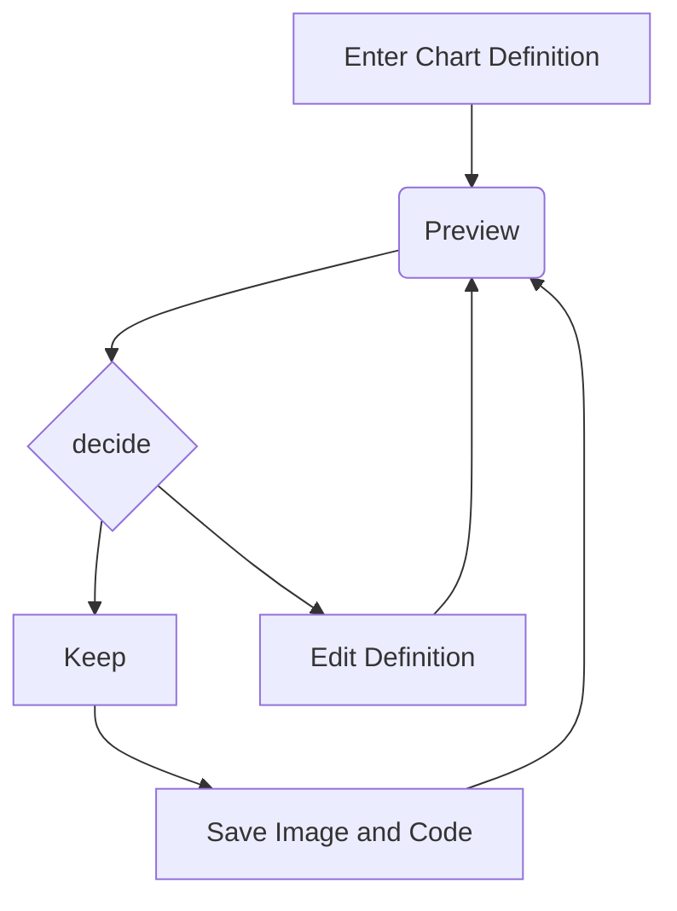

# Introduction

## R-Type

A multi-threaded server and a graphical client for the "R-Type" game using a homemade game engine.

Fully made in C++.

Below is a test for mermaid purposes:

```mermaid
graph TD
    A[Enter Chart Definition] --> B(Preview)
    B --> C{decide}
    C --> D[Keep]
    C --> E[Edit Definition]
    E --> B
    D --> F[Save Image and Code]
    F --> B
```
