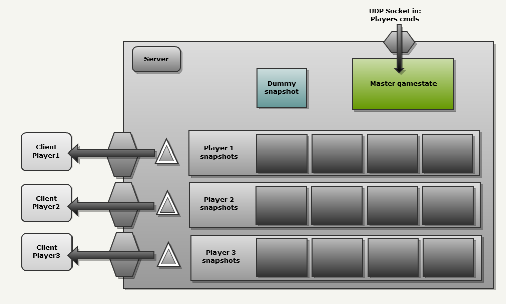
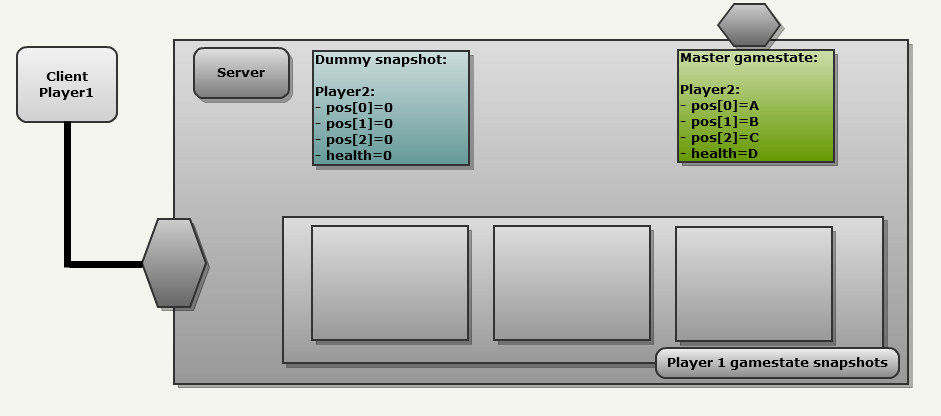
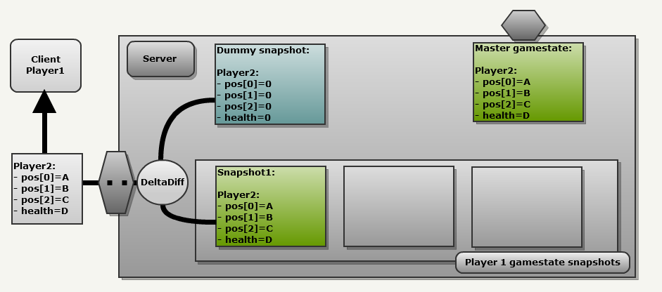
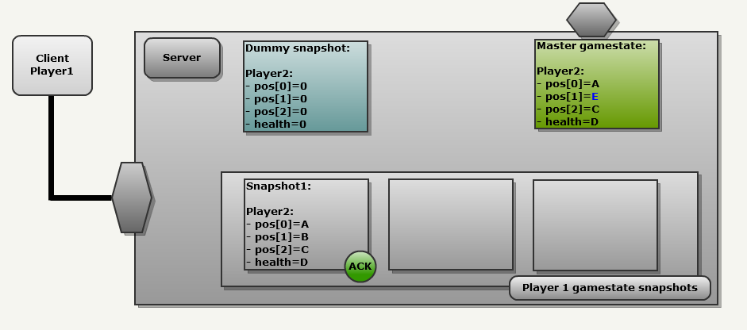
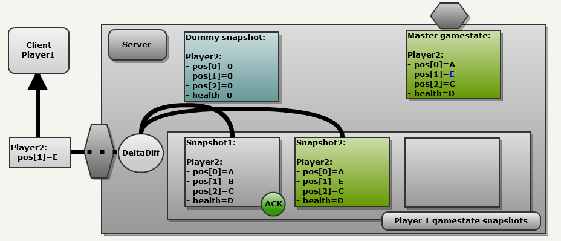
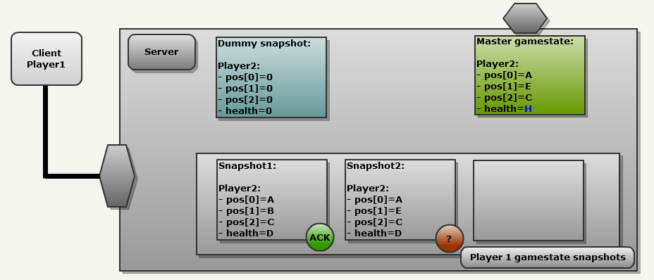
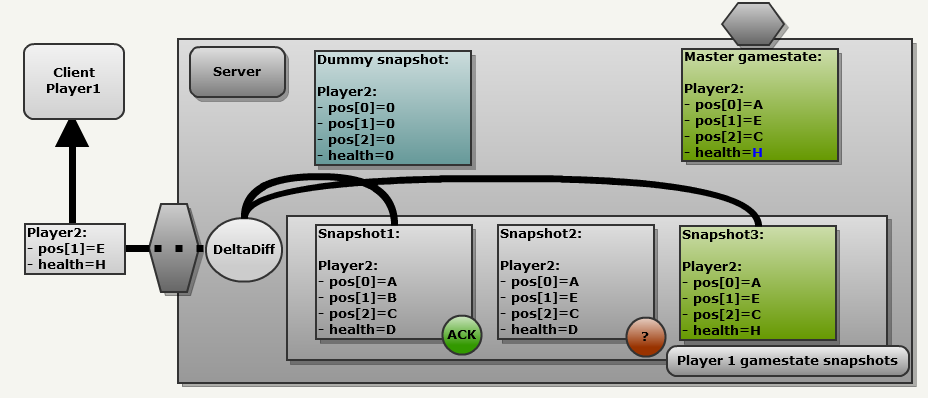

# Protocol

This protocol isn't definitive but represents globally how our protocol for the R-Type shall work between the server & client.

## Client Server Connection

The client is in one of three states:

- Disconnected
- Connecting
- Connected

Initially the client starts in *disconnected*.

Using these queries we implement the following logic when the server processes a **connection request** packet:

- If the server is full, reply with **connection denied**.
- If the connection request is from a new client and we have a slot free, assign the client to a free slot and respond with **connection accepted**.
- If the sender corresponds to the address of a client that is already connected, *also* reply with **connection accepted**. This is necessary because the first response packet may not have gotten through due to packet loss. If we don’t resend this response, the client gets stuck in the *connecting* state until it times out.

If the client receives **connection accepted**, it transitions to connected. If it receives **connection denied**, or after 5 seconds hasn’t received any response from the server, it transitions to disconnected.

Once the client hits *connected* it starts sending connection payload packets to the server. If no packets are received from the server in 5 seconds, the client times out and transitions to *connecting* (as it waits for a minute before transitioning to *disconnected*).

> [!NOTE]
> The following sections are inspired by [Fabien Sanglard Quake3 protocol](https://fabiensanglard.net/quake3/network.php)

## Server Architecture



- A **Master Gamestate** that is the universal true state of things. Clients send their commands on the communication channel. They are transformed in a packet which will modifiy the state of the game when they arrive on the server.
- For each client, the server keeps the **32 last gamestate** sent over the network in a cycling array: they are called snapshots. The array cycle with the famous binary mask trick that is mentionned in Quake World Network ([Some elegant things](http://fabiensanglard.net/quakeSource/quakeSourceNetWork.php)).
- The server also features **a "dummy" gamestate** with every single field set to zero. This is used to delta snapshots when there is no "previous state" available

## Snapshot system

In order to understand the snapshot system, here is an example with the following conditions:

- The server is sending update to a Client1.
- The server is attempting to propagate the state of Client2 which has four 4 fields (3 ints position[X], position[Y], position[Z] and one int health).

Server Frame 1:



In order to generate a message the network module will ALWAYS do the following :

1. Copy the Master gamestate in the next Client history slot.
2. Compare it with an other snapshot.

This is what we can see in the next drawing:

1. Master gamestate is copied at index 0 in Client1 history: It is now called"Snapshot1".
2. Since this is the first udpate, there are no valid snapshot in Client1 history so the engine is going to use the "Dummy snapshot" where all fields are always ZEROed. This results in a FULL update since every single field is sent to the NetChannel.



Server Frame 2:

Client2 has moved on the Y axis so pos[1] is now equal to E (in blue). Client1 has also sent commands but more important it has also acknowledged receiving the previous udpate so Snapshot1 has been marked as "ACK":



The process is the same:

1. Copy the Master gamestate in the next Client history slot: (index 1): This is Snapshot2
2. This time we have a valid snapshot in the client history (snapshot1). Compare those two snapshots

only a partial update ( pos[1] = E ) is sent over the network. This is the beauty of the design: The process is always the same.



Since each field is preceeded by a bit marker (1=changed, 0=not changed) the partial update above would uses 36 bits: `[0 1 32bitsNewValue 0 0]`

Server frame 3:



Regardless the process remains the same:

1. Copy the Master gamestate in the next Client history slot: (index 2): This is Snapshot3
2. Compare with the last valid acknowledged snapshot (snapshot1).



As a result the message sent it partial and contains a combination of old changes and new changes: (pos[1]=E and health=H). Note that snapshot1 could have been too old to be used. In this case the engine would have used the "dummy snapshot" again, resulting in a full update.

The beauty and elegance of the system resides in its simplicity. The same algorithm automatically:

- Generate partial or full update.
- Resend OLD information that were not received and NEW information in a single message.

## Packet:

> [!WARNING]
> This is an example, we don't guarantee that the structure will stay the same inside the game.

```cpp
struct Packet {
		int packetId;
		enum Cmd;
		std::string uuid; // Fixed length of 36 characters of length, could be represented by a fixed length array
		union structType {
			playerStruct;
			entityStruct;
			bool rep;
		};
};
```

## Commands(Enum)

Communication Server → Client:

- UpdatePlayer -> updates Player position or his velocity vector
- UpdateEntity -> update Entity position or his velocity vector
- KillPlayer -> the Player n°i is dead
- KillEntity -> the Entity n°j is destroyed
- AddPlayer -> adds a new Player to the game
- AddEntity -> adds a new Entity to the game
- DeadPlayer -> the client is dead → disconnected / spectate, only the own client receives that

Communication Client → Server:

- UpdatePlayer -> updates Player position or his velocity vector
- AddEntity -> adds a new Entity to the game
- Ack -> acknowledges the last recieved message.

## Serialization

To serialize, we are going to use `boost::serialize` with also `boost::endian` for platforms which differ in endianness.

## Going further

Changing the handshake from UDP to TCP is something we might want to do.

Here's how we're thinking on doing:
- Server sends UUID to the client
- The Client sends a Ok with his UUID
- The Server Sends him all the entities

## Resources

[building-a-game-network-protocol](https://gafferongames.com/categories/building-a-game-network-protocol/)

[Fabien Sanglard Quake3](https://fabiensanglard.net/quake3/network.php)

[Quake3 protocol](https://www.jfedor.org/quake3/)

[Serialization](https://stackoverflow.com/questions/3599638/how-can-i-wrap-stdwstring-in-boostasiobuffer)

[Endian Types](https://www.boost.org/doc/libs/latest/libs/endian/doc/html/endian.html)
